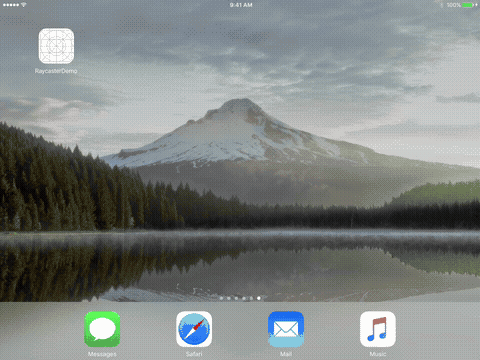
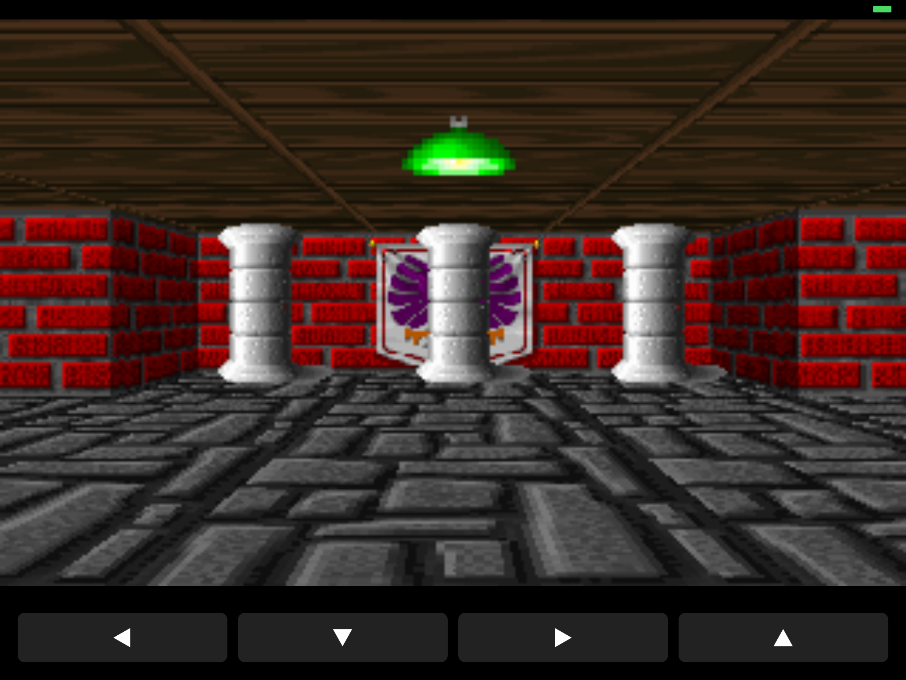

# raycaster-ios10-demo

Textured raycasting demo (Wolfenstein 3D style) for iOS 10, following [Lode's Computer Graphics Tutorial – Raycasting 3 (sprites)](https://lodev.org/cgtutor/raycasting3.html). Built with [Theos](https://theos.dev) for a 32-bit iPad 4 (A6X, `armv7s`) running iOS 10.3.4.

Programmatic UI, Auto Layout, full iPad rotation support, launch images, on-device controls, no third-party code signing required.

## Demo

Rendered on iPad 4 (iOS 10.3.4) at 60 fps:



[Watch the full video](demo.mp4)



## Controls

- **◀ ▼ ▶ ▲** on-screen buttons — turn left / move back / turn right / move forward (hold to keep moving)
- **Drag on the view** — smooth camera rotation
- The core raycasting algorithm is exactly the one from the tutorial (DDA, perpendicular wall distance to avoid fisheye, wall textures from `Resources/Textures/`, textured floor & ceiling casting, Y-side darkening, sprite casting via inverse camera matrix + 1D ZBuffer, far-to-near sorting, black = invisible)

## How it works

| File | Role |
|------|------|
| `RaycasterCore.c` | Pure C port of the tutorial's sprites raycasting: map, wall texture lookup, DDA loop, textured floor & ceiling casting, 1D ZBuffer, sorted sprite casting (barrels, pillars, green lights), movement + collision |
| `RaycasterView.m` | Renders the RGBA buffer via `CGBitmapContext` + `CADisplayLink` at 60 fps, loads the 11 PNGs (8 walls + 3 sprites) into texture slots, applies input each tick |
| `RaycasterDemoViewController.m` | Control pad (4 buttons) + pan gesture for rotation, Auto Layout |
| `Resources/` | `Info.plist`, launch images, `PkgInfo` |
| `Resources/Textures/` | The tutorial's wall textures plus sprite art (`barrel`, `pillar`, `greenlight`) |

## Requirements

- macOS with Xcode command line tools
- [Theos](https://theos.dev/docs/installation) with an iOS 10.3 SDK in `$THEOS/sdks/`
- 32-bit iOS 10 device (iPad 4 / iPhone 5 / iPhone 5c) — or jailbroken device for unsigned install

## Build

```sh
export THEOS=$HOME/theos
make                                  # .theos/obj/debug/RaycasterDemo.app
```

Build notes (SDK 10.3 + modern clang): `ARCHS = armv7 armv7s` (arm64 won't link with the patched SDK tebs), `USE_MODULES = 0`, `-Wl,-U,_memset`.

## Package as IPA

```sh
rm -rf Payload; mkdir -p Payload
ditto --noextattr --norsrc .theos/obj/debug/RaycasterDemo.app Payload/RaycasterDemo.app
COPYFILE_DISABLE=1 zip -rXq RaycasterDemo.ipa Payload
rm -rf Payload
```

## Install

Jailbroken device (e.g. [Socket](https://socket-jb.app)) + [AppSync Unified](https://cydia.akemi.ai/):

```sh
ideviceinstaller install RaycasterDemo.ipa   # over USB, no Apple ID
```

Non-jailbroken: sideload with Sideloadly / Impactor using an Apple ID.

## Screenshot

The tutorial's raycasting 3 map (24x24) with the tutorial's texture order (`eagle`, `redbrick`, `purplestone`, `greystone`, `bluestone`, `mossy`, `wood`, `colorstone`) and 3 sprite types (19 barrels, pillars and green lights).

## Credits

Raycasting algorithm, map, textures and sprites from [lodev.org](https://lodev.org/cgtutor/raycasting3.html) by Lode Vandevenne.